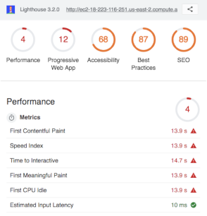
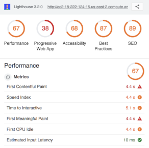
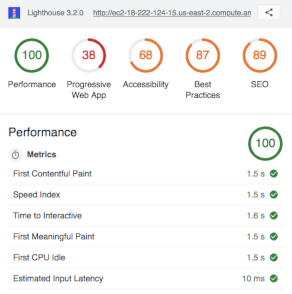

# image-carousel-component
> Image Carousel Component for Real Estate Listing Page

This repository contains the source for a single component of a real estate listing page built with a microservice architecture. The component is designed as a full stack service and includes a database and web server which serves a client application and a restful api. The API provides different image links to the client depending on a listing id number.

For this project, a team of developers each contributed individual components which were combined into a full listing page. To view the complete listing application, check out the related [listing page repo](https://github.com/Team-Elysium/streeteasy-listing-proxy-server-jte).

## Related Repositories

- Complete Listing Page
  - [Full Listing Proxy Server](https://github.com/Team-Elysium/streeteasy-listing-proxy-server-jte)

- Related Components on Listing Page
  - [Listing Details Component](https://github.com/Team-Elysium/listing-details)
  - [Listing Description Component](https://github.com/Team-Elysium/Description-Amenities-About_the_Building)
  - [Similiar Listings Component](https://github.com/Team-Elysium/Similar-Listings-Recommendations)

## Requirements

#### External API Key

- This project makes use of the MapBox API to access static map images. To get an API key visit: https://www.mapbox.com/signup

#### Key Dependencies

- [Node.js](https://nodejs.org/en/) with [Express.js](https://expressjs.com/) web framework
- [MongoDB](https://www.mongodb.com/) database with [Mongoose ODM](https://mongoosejs.com/) for Node
- [React](https://reactjs.org/docs/getting-started.html) front end framework
- [Eric Meyer's CSS Reset](https://meyerweb.com/eric/tools/css/reset/)
- Testing:
  - [Mocha](https://mochajs.org)
  - [Chai](https://www.chaijs.com)
  - [Jest](https://jestjs.io/)
  - [Supertest](https://www.npmjs.com/package/supertest)
- ESLint for maintaining [AirBnB JS styleguide](https://github.com/airbnb/javascript)

## Development Setup and Server Provisioning

1. Create a server instance to run the project on - **Ubuntu Server 18.04 LTS** is recommended
2. On the server, allow traffic on ports 22 for SSH and 80 for HTTP access
3. Connect to the server via SSH and run `git clone https://github.com/Team-Elysium/image-carousel-component` to retrieve the project repo
4. Navigate into the repo with `cd image-carousel-component` 
5. Run `sudo chmod +x deployment/deploy.sh && sudo deployment/deploy.sh`  to run the deployment script and provision the server. This script will do the do the following:
   - Create `config.js` with a MapBox API key
   - Install MongoDB, Node.js and npm
   - Install npm Forever process manager module globally to run server
   - Install npm dependencies
   - Populate database with randomized real estate listing image links
   - Run Webpack to transpile React application
   - Make `rc.local` script executable and copy to `/etc` directory so web server starts on server restart
   - Run rc.local to map port 80 to 3000, start MongoDB and Express.js web server using Forerver process manager

This project serves randomized listing images based on id numbers from 0 to 99 with fancier listing images appearing at higher numbers. With the web server up and runing, direct a browser to endpoints /0 to /99 to view carousels with a variety of images.

## Performance Optimizations

One project goal was to minimize dependence on external css and javascript libraries to reduce the amount of code served to the client. Other team members used libraries like Bootstrap and jQuery to build their components but adding minified versions of those two libraries alone requires the user to download roughly 62.4KB in addition to a minified React application for a total of *~100KB*, just for a single component's CSS and Javascript. By bundling and minifying project javascript and dependencies using webpack, all CSS and Javascript for this component is served in 3 files totalling *~50KB*.

Google's [Lighthouse](https://developers.google.com/web/tools/lighthouse/) performance auditing tool was used to assess the service's performance in terms of time to serve assets and general web app best practices. Amazon Web Services was used to deploy and test the application - to test performance, Amazon's AMI imaging service was used to create two identical servers for AB testing.

- Initial Performance

  - Initial measurements made with Lighthouse revealed that mobile performance on a 3G network was *quite* poor and that enabling text compression with gzip could minimize the number of bytes served:

    

- Implementing gzip compression

  - The [compression](https://www.npmjs.com/package/compression) node module was used Express.js middleware to compress text files and Lighthouse showed that a *First Contentful Paint* could be achived ~10s faster:

    

- Using webpack production bundling

  - Even with gzip compression, the main application file `bundle.js` was still the largest resource slowing page load. The project's React components were being transpiled into `bundle.js` using the webpack command `webpack -d --watch` to create a bundle that would be updated as source files changed and transpiled in to a human readable development file. By running webpack with `webpack -p` it is possible to create a minified bundle for production. This decreased the uncompressed size of bundle.js from **2.43 MB** to **148KB** - more than an order of magnitude. With a minified and compressed `bundle.js` the time to First Meaningful Paint was reduced to 1.5s:

    

- Additional optimizations

  - Further optimized performance could be achived by compressing static files on the server and serving static content with a reverse proxy server layer such as Nginx. Additionally, webpack was used to minify bundle.js files but the two project stylesheets could also be combined and minified also using webpack.

## API Documentation

This project includes a restful API to provide image URLs to the component. For documentation please view:

[Image Carousel API Documentation](documentation/api-documentation.md)

## Authors

* **Jared Ellison** - [jaredellison.net](http://jaredellison.net)

## Acknowledgments

- **Project Team** - *Each contributed similar components to full listing page*
  - [Sujin Lee](https://github.com/slee1016)
  - [Austin Joo](https://github.com/AustinJoo)
  - [Muhammad Mosaad](https://github.com/mowithafro)
- **Technical Mentors**
  - [Joseph Martin](https://github.com/jpranaymartin)
  - [Trent Going](https://github.com/trentgoing)

## References

- [Installing MongoDB on Ubuntu 18.04](https://www.digitalocean.com/community/tutorials/how-to-install-mongodb-on-ubuntu-18-04)
- [Installing Node on Ubuntu 18.04](https://www.digitalocean.com/community/tutorials/how-to-install-node-js-on-ubuntu-18-04)
- [ReactCSSTransitionGroup Add-On Documentation](https://reactjs.org/docs/animation.html)
- [Updating React Component State When Props Change](https://reactjs.org/docs/react-component.html#static-getderivedstatefromprops)

